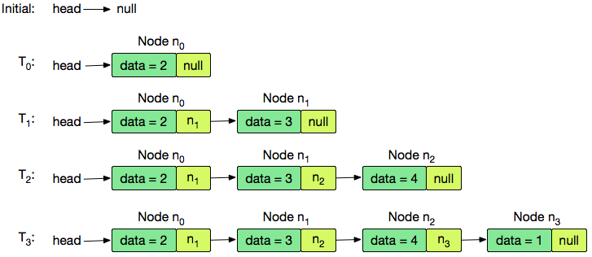

# Day 14: Scope
Reference: https://www.hackerrank.com/challenges/30-linked-list/problem

### Objective
Today we will work with a Linked List. Check out the Tutorial tab for learning materials and an instructional video.

A Node class is provided for you in the editor. A Node object has an integer data field, , and a Node instance pointer, , pointing to another node (i.e.: the next node in the list).

A Node insert function is also declared in your editor. It has two parameters: a pointer, , pointing to the first node of a linked list, and an integer, , that must be added to the end of the list as a new Node object.

### Task
Complete the insert function in your editor so that it creates a new Node (pass  as the Node constructor argument) and inserts it at the tail of the linked list referenced by the  parameter. Once the new node is added, return the reference to the  node.

Note: The  argument is null for an empty list.

### Input Format

The first line contains T, the number of elements to insert.
Each of the next  lines contains an integer to insert at the end of the list.

### Output Format

Return a reference to the  node of the linked list.

### Sample Input

    STDIN   Function
    -----   --------
    4       T = 4
    2       first data = 2
    3
    4
    1       fourth data = 1

### Sample Output

    2 3 4 1

### Explanation

**_T = 4_**, so your method will insert **_4_** nodes into an initially empty list.
First the code returns a new node that contains the data value **_2_** as the **_head_** of the list. Then create and insert nodes **_3_**, **_4_**, and **_1_** at the tail of the list.

